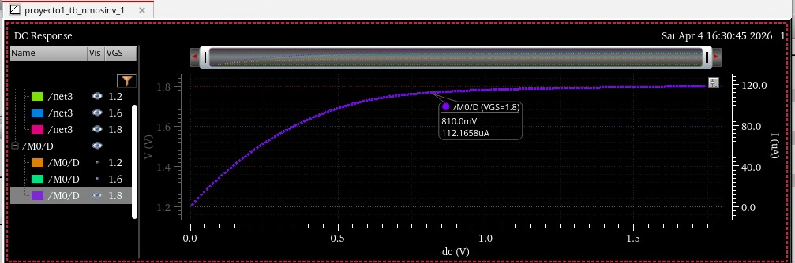
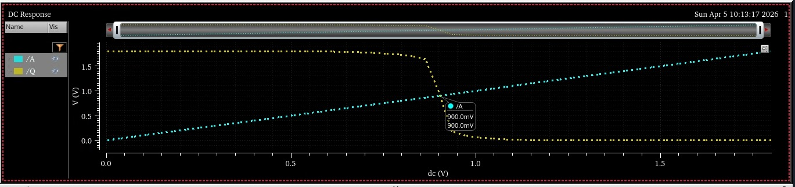
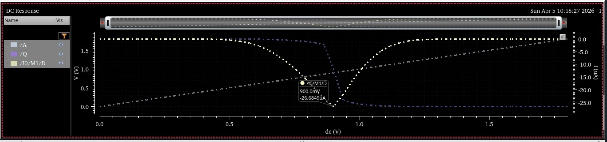
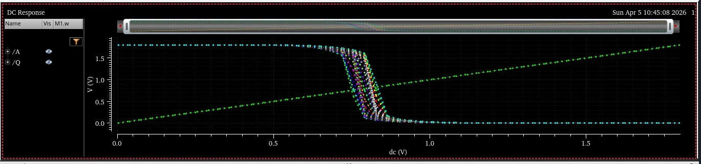
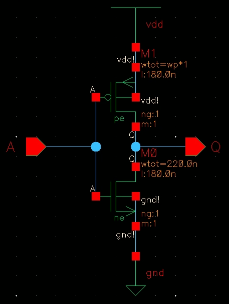

# Tarea 1: Introducción al Diseño de Circuitos Integrados

**Randy Steve Fernández Aguilar, David Andres Leiton Flores y Leonardo Perez Sandoval**

*Escuela de Ingeniería Electrónica, Instituto Tecnológico de Costa Rica (ITCR), Cartago, Costa Rica*

## Resumen

Este informe presenta el desarrollo de la Tarea 1 del curso Introducción al Diseño de Circuitos Integrados, orientada al análisis y diseño de dispositivos CMOS en la tecnología XFAB XH018 de 1.8 V. En la primera parte, se realiza la caracterización de primer orden del transistor mínimo, tomando como base un transistor unitario de dimensiones $4\lambda/2\lambda$, con el fin de estimar la resistencia efectiva de canal mediante distintos modelos analíticos, la capacitancia equivalente de compuerta y la constante $RC$ del proceso. En la segunda parte, se aborda el diseño de un inversor mínimo de tamaño óptimo con margen de ruido simétrico, combinando soluciones analíticas y simulaciones en Virtuoso/Spectre para determinar la relación adecuada entre los transistores PMOS y NMOS.

**Palabras Clave:** CMOS, XFAB XH018, transistor mínimo, resistencia efectiva, inversor CMOS, margen de ruido, retardo de propagación, relación PMOS/NMOS, Virtuoso, Spectre.

---

## Introducción

Este documento desarrolla la Tarea 1 del curso Introducción al Diseño de Circuitos Integrados, centrada en el análisis y diseño de dispositivos CMOS en la tecnología XFAB XH018 de 1.8 V. En una primera etapa, se realiza la caracterización de primer orden del transistor mínimo del proceso, con el propósito de estimar su resistencia efectiva de canal, su capacitancia equivalente de compuerta y la constante $RC$ asociada. En una segunda etapa, se aborda el diseño de un inversor CMOS mínimo de tamaño óptimo, considerando criterios de margen de ruido, retardo de propagación y comportamiento frente a variaciones de proceso. De esta forma, el trabajo aborda el análisis analítico inicial como la validación y comparación de resultados mediante simulación, de acuerdo con los requerimientos planteados en el enunciado.

---

## Parte 1: Determinación de parámetros del transistor mínimo

### Planteamiento del transistor unitario

De acuerdo con el enunciado, se asume un transistor unitario de dimensiones $4\lambda/2\lambda$. Para un proceso de $0.18~\mu m$, se tiene

$$ 2\lambda = 0.18~\mu m $$

por lo tanto,

$$ \lambda = 0.09~\mu m. $$

Así, las dimensiones del transistor mínimo son las siguientes:

$$ W_{dib} = 4\lambda = 0.36~\mu m $$
$$ L_{dib} = 2\lambda = 0.18~\mu m. $$

Estas dimensiones se utilizarán tanto para el cálculo de la resistencia efectiva como para la estimación de la capacitancia equivalente de compuerta.

### Resistencia efectiva del transistor mínimo NMOS

El circuito de medición considerado corresponde a un transistor NMOS con la compuerta conectada a $V_{DD}$, la fuente conectada a tierra y el drenaje unido a un capacitor inicialmente cargado a $V_{DD}$. Bajo esta configuración, la salida conmuta desde $V_{DD}$ hasta GND descargando el capacitor a través del transistor encendido.

  
*Figura 1: Circuito de prueba para estimar la resistencia efectiva del NMOS y representación cualitativa de la característica $I_D$-$V_{DS}$.*

Para la corriente de referencia se usan los parámetros típicos del proceso XH018 para transistores de 1.8 V. En particular,

$$ I_{ON} = I_{dsat}(V_{gs}=V_{ds}=1.8\,\text{V},\, W/L=10/0.18) = 475~\mu\text{A}/\mu\text{m} $$

  
*Figura 2: Parámetros típicos para transistores de 1.8 V de la tecnología XFAB XH018 empleados en los cálculos de la Parte 1.*

Como aproximación de primer orden, esta corriente se escala por el ancho del transistor mínimo,

$$ I_H \approx I_{dsat} \approx 475~\mu A/\mu m \cdot 0.36~\mu m, $$

por lo que

$$ I_H \approx 171~\mu A. $$

#### Cálculo con la ecuación (4.16)

De acuerdo con la literatura, si durante la descarga el transistor permanece suficientemente en saturación de velocidad y la corriente puede considerarse aproximadamente constante, la resistencia efectiva se estima como

$$ R_n^{(4.16)} \approx \frac{V_{DD}}{2I_{dsat}}. $$

Con $V_{DD}=1.8~V$ e $I_{dsat}\approx 171~\mu A$,

$$ R_n^{(4.16)} \approx \frac{1.8}{2(171\times 10^{-6})}=5.263~k\Omega. $$

#### Cálculo con la ecuación (4.19)

La ecuación (4.19) mejora la aproximación anterior al considerar que la entrada no sube instantáneamente, de manera que la corriente del transistor cambia entre un valor inicial $I_L$ y un valor final $I_H$ durante la transición. En este caso,

$$ R_n^{(4.19)} = \frac{V_{DD}}{I_H + I_L}. $$

Para estimar $I_L$, se toma la recomendación del documento de parámetros de XFAB para transistores mínimos, donde se indica que en esta tecnología es probable la presencia de saturación de velocidad y se sugiere un modelo I--V lineal de primer orden. Usando un umbral aproximado de transistor mínimo

$$ V_T(W/L=0.22/0.18) \approx 0.45~V, $$

se emplea la proporcionalidad lineal con el sobrevoltaje:

$$ I_L \approx I_{ON}\cdot \frac{(V_{DD}/2)-V_T}{V_{DD}-V_T}. $$

Sustituyendo valores,

$$ I_L \approx 171~\mu A \cdot \frac{0.9-0.45}{1.8-0.45} = 57~\mu A. $$

Por lo tanto,

$$ R_n^{(4.19)} \approx \frac{1.8}{171\times 10^{-6}+57\times 10^{-6}}=7.89~k\Omega. $$

#### Discusión de resultados

Los resultados obtenidos con ambas ecuaciones son distintos porque la ecuación (4.16) trata la descarga como si el transistor condujera una corriente casi constante durante toda la transición. En contraste, la ecuación (4.19) incorpora el efecto del tiempo de subida finito de la entrada, por lo que la corriente del transistor cambia entre un valor inicial $I_L$ y uno final $I_H$, aumentando la resistencia efectiva calculada. En consecuencia, la ecuación (4.16) resulta útil como una primera estimación rápida, mientras que la ecuación (4.19) ofrece una aproximación más realista dentro del modelo analítico empleado. Por lo tanto tenemos las siguiente resistencias efectivas para ambos casos,

$$ R_n^{(4.16)} \approx 5.263~k\Omega $$
$$ R_n^{(4.19)} \approx 7.89~k\Omega. $$

### Capacitancia equivalente de compuerta y constante RC

Para esta parte se utilizan los parámetros del transistor NMOS de 1.8 V del proceso XH018:

$$ C_{OX}=8.46~\mathrm{fF}/\mu m^2, $$
$$ C_{OV}=0.33~\mathrm{fF}/\mu m, $$
$$ \Delta L = 0.02~\mu m, $$
$$ \Delta W = 0.05~\mu m. $$

El documento de parámetros indica que, para una estimación más pesimista de $C_{gs}$ en conmutación, debe emplearse la expresión correspondiente al caso en que el transistor cambia entre corte y triodo. Primero, se calculan las dimensiones efectivas:

$$ L_{eff} = L_{dib} - \Delta L = 0.18 - 0.02 = 0.16~\mu m $$
$$ W_{eff} = W_{dib} - \Delta W = 0.36 - 0.05 = 0.31~\mu m. $$

La capacitancia de traslape drenaje-compuerta es

$$ C_{gd}=W_{eff}C_{OV}=0.31\cdot 0.33=0.102~\mathrm{fF}. $$

Para la capacitancia fuente-compuerta se usa la versión pesimista:

$$ C_{gs}=W_{dib}L_{dib}C_{OX}+W_{dib}C_{OV}. $$

Sustituyendo,

$$ C_{gs}=(0.36)(0.18)(8.46)+(0.36)(0.33)=0.667~\mathrm{fF}. $$

Como aproximación de primer orden para la capacitancia equivalente de compuerta, se toma la suma dominante

$$ C \approx C_{gs}+C_{gd}, $$

por lo que

$$ C \approx 0.667+0.102=0.769~\mathrm{fF}. $$

El enunciado indica que se suponga que las capacitancias de difusión son iguales a la capacitancia de compuerta, de manera que

$$ C_{db}=C_{sb}=C\approx 0.769~\mathrm{fF}. $$

Finalmente, para la constante del proceso se emplea la resistencia efectiva obtenida con la ecuación (4.19), por ser la aproximación más realista de las dos consideradas:

$$ RC = (7.89~k\Omega)(0.769~\mathrm{fF})=6.07~ps. $$

---

## Resultados principales

Los resultados finales de la primera parte de la tarea son los siguientes:

- Resistencia efectiva usando la ecuación (4.16):  
  $$ R_n^{(4.16)} \approx 5.263~k\Omega $$

- Resistencia efectiva usando la ecuación (4.19):  
  $$ R_n^{(4.19)} \approx 7.89~k\Omega $$

- Capacitancia equivalente de compuerta:  
  $$ C \approx 0.769~\mathrm{fF} $$

- Capacitancias de difusión asumidas:  
  $$ C_{db}=C_{sb}=0.769~\mathrm{fF} $$

- Constante del proceso:  
  $$ RC \approx 6.07~ps $$

---

## Parte 2: Diseño de un inversor mínimo de tamaño óptimo

### 2.a: Diseño de un inversor mínimo con margen de ruido simétrico

Se diseñó un inversor CMOS mínimo en la tecnología XFAB XH018 de 1.8 V, imponiendo que el transistor NMOS tuviera el tamaño mínimo permitido por la tecnología y buscando que el punto de transición del inversor se ubicara en

$$ V_M = \frac{V_{DD}}{2} = 0.9~V. $$

#### Selección del modelo de transistor

**Verificación de saturación de velocidad**  
Para tecnología de $0.18\ \mu m$ con $V_{DD} = 1.8\text{ V}$:
$$ E_{aplicado} = \frac{V_{DD}}{L_{eff}} = \frac{1.8}{0.16} = 11.25\text{ V}/\mu\text{m} $$
De la literatura sabemos que:  
$$ E_c \approx 1 - 2\text{ V}/\mu\text{m} $$  
Dado que $E_{aplicado} \gg E_c$, se confirma que estamos en **saturación de velocidad**. Esto provoca lo siguiente:
- Causa que la velocidad de los portadores se sature.
- Como consecuencia, la corriente ya no depende del cuadrado del voltaje, sino que depende linealmente del voltaje.

Como primer paso, se realizó una simulación rápida del transistor mínimo para identificar el régimen de operación más adecuado para el cálculo analítico. A partir de la familia de curvas $I_D$--$V_{DS}$ del NMOS mínimo, se observó que la corriente comienza a saturarse a un valor de $V_{DS}$ significativamente menor que el esperado por el modelo de canal largo, donde

$$ V_{DS,sat,long} \approx V_{GS}-V_T. $$

Usando $V_{GS}=1.8~V$ y el valor típico $V_T \approx 0.45~V$ para un NMOS cercano al mínimo en la tecnología XH018, se obtiene

$$ V_{DS,sat,long} \approx 1.35~V. $$

Sin embargo, en la simulación la curva comienza a aplanarse alrededor de $V_{DS,sat,obs}\approx 0.8~V$, lo cual indica saturación temprana y comportamiento de canal corto. Por esta razón, para el dimensionamiento inicial del inversor se adoptó el modelo de saturación de velocidad en lugar del modelo cuadrático de canal largo, como se puede observar en la Figura 3.

  
*Figura 3: Curva $I_D$--$V_{DS}$ del NMOS mínimo (sat).*

#### Solución analítica inicial

Utilizando la ecuación (2.57) de la sección 2.5.2 de la bibliografía para el voltaje de conmutación y sustituyendo $V_{INV}$:

$$ 0.9 = \frac{1.8 + V_{tp} + V_{tn}\left(\frac{1}{r}\right)}{1 + \frac{1}{r}} $$

*Nota: El libro asume que $C_{ox}$ es similar para ambos transistores, pero en la realidad sí presentan ligeras diferencias.*

Donde la relación $r$ se define como:

$$ r = \frac{W_p v_{sat-p}}{W_n v_{sat-n}} $$

Para encontrar la relación de tamaños $W_p/W_n$, debemos despejar $r$. Si asumiéramos simetría perfecta ($V_{tn} \approx |V_{tp}|$), la ecuación se simplificaría. En ese caso ideal, si $V_{tn} = |V_{tp}| \implies V_{INV} = V_{DD}/2$, tendríamos $r=1$.

**Cálculo de la Relación de Corrientes**  
En la zona de saturación de velocidad, la corriente se aproxima por:

$$ I_{dsat} \approx W \cdot I_{ON} $$

Para que el inversor conmute en $V_{DD}/2$, la capacidad de "tirar" hacia abajo (NMOS) debe ser igual a la capacidad de "tirar" hacia arriba (PMOS) en ese punto de transición. Por lo tanto, la relación de anchos necesaria es inversamente proporcional a la relación de corrientes:

$$ \frac{W_p}{W_n} \approx \frac{I_{ONn}}{I_{ONp}} = \frac{475}{170} \approx 2.794 $$

Por otro lado, sustituyendo los valores reales de los voltajes de umbral extraídos de la tabla ($V_{tn} = 0.58\text{ V}$, $V_{tp} = -0.65\text{ V}$) en la ecuación analítica de $V_{INV}$:

$$ 0.9 = \frac{1.8 + (-0.65) + 0.58\left(\frac{1}{r}\right)}{1 + \frac{1}{r}} $$
$$ 0.9 \left(1 + \frac{1}{r}\right) = 1.15 + \frac{0.58}{r} $$
$$ 0.9 + \frac{0.9}{r} = 1.15 + \frac{0.58}{r} $$
$$ 0.9 - 1.15 = -\frac{0.9}{r} + \frac{0.58}{r} $$
$$ -0.25 = \frac{-0.32}{r} $$
$$ r = \frac{-0.32}{-0.25} \implies r = 1.28 $$

En la literatura, si definimos $r$ como una relación efectiva que incluye las movilidades y velocidades de los portadores:

$$ \frac{W_p}{W_n} = r \cdot \frac{\mu_n}{\mu_p} $$
$$ \frac{W_p}{W_n} = 1.28 \cdot \frac{307}{59} \approx 6.6 $$

*Nota: Esta relación es muy alta en teoría. En la práctica, para un proceso de $0.18\ \mu m$, suele estar entre $2.5$ y $3.5$.*

#### Dimensiones propuestas

Usando la relación de corrientes $I_{ON}$ del datasheet de XFAB, obtenemos una primera estimación empírica y más realista:

$$ \frac{W_p}{W_n} \approx 2.8 $$

**Estimación inicial mínima (sin considerar contactos):**  
Se proponen dimensiones iniciales basándose en los mínimos permitidos por el proceso XFAB:
- $L = 0.18\ \mu m$
- $W_n = 0.22\ \mu m$ (mínimo)
- $W_p \approx 3 \times W_n \approx 0.66\ \mu m$

El objetivo será hacer iteraciones en simulación para afinar este valor de diseño.

**Cálculo analítico para incluir contactos de difusión:**  
Para que haya espacio físico suficiente para colocar contactos de difusión en el layout, debemos cumplir con las reglas escalables basadas en el parámetro $\lambda$:

$$ \lambda = 0.09\ \mu m $$
$$ W_{min} \text{ práctico con contactos} = 4\lambda = 4(0.09\ \mu m) = 0.36\ \mu m $$

**Dimensión recomendada NMOS final:**
- $W_n = 0.36\ \mu m\ (4\lambda) \longrightarrow$ Permite colocar 2 contactos de difusión.
- $L_n = 0.18\ \mu m\ (2\lambda) \longrightarrow$ Longitud mínima permitida.

#### Dimensiones mínimas y solución analítica inicial

Se fijó el NMOS con dimensiones mínimas:

$$ W_n = 0.36~\mu m, \qquad L_n = 0.18~\mu m $$

y se planteó una solución analítica inicial para el PMOS, imponiendo que el inversor conmutara en $V_M=V_{DD}/2$. Como aproximación de primer orden, se igualaron las capacidades de conducción del PMOS y del NMOS en el punto de transición, utilizando el modelo correspondiente a saturación de velocidad. A partir de los parámetros típicos del proceso XH018 para transistores de 1.8 V, se obtuvo una primera estimación de la relación PMOS/NMOS:

$$ \frac{W_p}{W_n} \approx 3. $$

Con ello, se propuso inicialmente:

$$ W_p = 1.08~\mu m, \qquad L_p = 0.18~\mu m. $$

#### Verificación de la curva característica

Posteriormente, se verificó el diseño mediante un barrido DC de la entrada del inversor entre $0$ y $1.8~V$, obteniendo la curva de transferencia $V_{out}$--$V_{in}$.

  
*Figura 4: Curva característica DC del inversor CMOS para la relación final PMOS/NMOS.*

A partir de la intersección entre la curva de salida y la recta $V_{out}=V_{in}$, se observó que el punto de transición del inversor se ubica aproximadamente en

$$ V_M \approx 0.9~V, $$

lo cual es cercano a $V_{DD}/2=0.9~V$. Por tanto, se considera que el inversor cumple aproximadamente la condición de margen de ruido simétrico solicitada.

#### Corriente de cortocircuito

Usando el mismo barrido DC, se midió la corriente de la rama de alimentación del inversor, equivalente a la corriente que circula por el PMOS cuando ambos transistores conducen simultáneamente alrededor del punto de transición.

  
*Figura 5: Corriente de cortocircuito del inversor medida durante el barrido DC.*

La corriente es prácticamente nula para valores de entrada cercanos a $0$ y $1.8~V$, y presenta un máximo alrededor del punto de transición. El valor máximo medido fue:

$$ I_{SC,\max} \approx 26.68~\mu A. $$

#### Iteraciones empíricas de la relación PMOS/NMOS

Además de la solución analítica, se realizaron iteraciones empíricas variando manualmente el ancho del transistor PMOS mientras se mantenía fijo el NMOS mínimo. El objetivo fue desplazar el punto de transición del inversor hasta aproximarlo a $V_{DD}/2$.

| Relación $W_p/W_n$ | $V_M$ observado |
|--------------------|-----------------|
| 2.8                | 0.83 V          |
| 3.8                | 0.85 V          |
| 4.8                | 0.88 V          |
| 5.5                | 0.89 V          |
| 6                  | 0.9 V           |

*Tabla 1: Iteraciones empíricas de la relación PMOS/NMOS para centrar el punto de transición.*

A partir de estas iteraciones, se seleccionó como solución final una relación PMOS/NMOS de aproximadamente:

$$ \frac{W_p}{W_n} \approx 6. $$

En resumen, el modelo analítico idealizado predijo una relación PMOS/NMOS cercana a 6.6, mientras que la estimación práctica basada en las corrientes $I_{ON}$ del proceso sugirió un valor inicial de aproximadamente 2.8. No obstante, las simulaciones empíricas en Virtuoso/Spectre mostraron que la relación que mejor centra el punto de transición en $V_{DD}/2$ para el inversor final es aproximadamente 6, lo que evidencia la diferencia entre el modelo simplificado, la estimación de primer orden y el comportamiento real descrito por el modelo utilizado por Virtuoso. Ahora bien, para que se cumpliera dicho diseño se tiene que el ancho final del PMOS deberia ser:

$$ W_p = 2.16~\mu m $$

#### Simulación en esquinas de proceso

Finalmente, se ejecutó nuevamente la simulación DC del inversor usando la relación final PMOS/NMOS, esta vez sobre las distintas esquinas de variabilidad del proceso disponibles en la PDK. Las curvas $V_{out}$--$V_{in}$ obtenidas se superpusieron en una sola figura.

  
*Figura 6: Curvas de transferencia del inversor en distintas esquinas de proceso.*

Se observa una dispersión moderada del punto de transición entre esquinas, lo cual es consistente con las variaciones de $V_T$, movilidad y corriente de conducción de los transistores. No obstante, las curvas permanecen agrupadas alrededor de la vecindad de $V_{DD}/2$, por lo que la solución final puede considerarse razonablemente robusta frente a variaciones de proceso.

#### Discusión de divergencias

Se observaron diferencias entre la estimación analítica inicial y los resultados obtenidos mediante simulación. Estas divergencias se atribuyen principalmente a que el cálculo a mano utiliza un modelo simplificado del transistor, mientras que Spectre emplea modelos más completos del proceso. En particular, para transistores mínimos de la tecnología XH018, el comportamiento de canal corto y la saturación de velocidad modifican la forma real de la curva $I$--$V$, de modo que la relación PMOS/NMOS final requerida para obtener $V_M \approx V_{DD}/2$ difiere de la predicción analítica inicial. Asimismo, la corriente de cortocircuito medida en simulación depende del traslape real de conducción entre el PMOS y el NMOS alrededor del punto de transición, así como de parámetros efectivos del modelo de proceso, por lo que también puede diferir de una estimación simplificada.

### 2.b: Análisis de retardos en función de la relación PMOS/NMOS

Se realizó la simulación del inversor CMOS considerando una relación inicial PMOS/NMOS de 2/1, y posteriormente se varió el tamaño del transistor PMOS para analizar su efecto sobre los tiempos de retardo de subida ($t_{pdr}$) y bajada ($t_{pdf}$). Considerando que el valor minimo del NMOS es de $220 nm$ y el del PMOS $440 nm$.

#### Circuito

  
*Figura 7: Inversor*

  
*Figura 8: Circuito FO4*

#### Resultados obtenidos

  
*Figura 9: Barrido de Wp*

  
*Figura 10: tpdr y tpdf vs Relación PMOS y NMOS*

  
*Figura 11: Diff segun la relación de PMOS y NMOS*

| Relación PMOS/NMOS | $t_{pdf}$ (ns) | $t_{pdr}$ (ns) | $t_{pdr} - t_{pdf}$ (ns) |
|--------------------|----------------|----------------|---------------------------|
| 2                  | 0.465          | 0.500          | 0.035                     |
| 3                  | 0.484          | 0.499          | 0.015                     |
| 4                  | 0.515          | 0.510          | -0.005                    |
| 5                  | 0.553          | 0.533          | -0.020                    |

*Tabla 2: Tiempos de retardo en función de la relación PMOS/NMOS*

#### Análisis

Se observa que al aumentar la relación PMOS/NMOS:
- El retardo de bajada ($t_{pdf}$) aumenta debido al incremento de la capacitancia de carga.
- El retardo de subida ($t_{pdr}$) disminuye inicialmente, ya que el PMOS se vuelve más fuerte.

La diferencia entre retardos cambia de signo, indicando un punto de balance donde:

$$ t_{pdr} \approx t_{pdf} $$

A partir de la interpolación de los datos, este punto ocurre aproximadamente en:

$$ \frac{W_p}{W_n} \approx 3.76 $$

lo cual corresponde a una condición de conmutación simétrica. Para adquirir dicho resultado se parametrizo el $Wp$ o ancho del PMOS y se coloco manualmente los distintos anchos dado que nuestra versión de Candace virtuoso no ofrece realiza un barrido optimizado, el rango de valores seleccionados van desde $440nm$ hasta los $2640 nm$.

#### Interpretación física

Este resultado es consistente con la menor movilidad de los huecos respecto a los electrones, lo cual requiere un transistor PMOS más grande para compensar la diferencia y lograr retardos equilibrados.

#### Función del SPICE deck

El SPICE deck de la permite analizar y optimizar automáticamente el desempeño de un inversor CMOS bajo condiciones de carga tipo FO4. El circuito se basa en un inversor parametrizable, donde el ancho del PMOS se define mediante una variable, manteniendo fijo el NMOS. Se implementa una cadena de inversores con cargas crecientes para modelar un escenario realista de propagación. El deck realiza una simulación transitoria y mide automáticamente los retardos de subida ($t_{pdr}$) y bajada ($t_{pdf}$), evaluando además su diferencia:

$$ diff = t_{pdr} - t_{pdf} $$

Mediante un algoritmo de optimización, se ajusta el tamaño del PMOS dentro de un rango definido para minimizar esta diferencia, buscando cumplir:

$$ t_{pdr} \approx t_{pdf} $$

Esto permite encontrar de forma automática la relación óptima $W_p/W_n$, la cual en este trabajo coincide aproximadamente con el valor obtenido manualmente ($\approx 3.76$). En general, el método automático ofrece mayor precisión, mientras que el análisis manual permite una mejor comprensión del comportamiento del circuito.

#### Comparación con optimización automática

El método manual permite comprender el comportamiento físico del circuito y ubicar aproximadamente el punto óptimo, mientras que el optimizador permite refinar este resultado con mayor precisión. Dadas las circunstancias el metodo manual lo consideramos la modificación directa de los tamaños en cada transistor, mientras que la optimización la consideramos como barridos paramétricos. Desde el punto de vista de diseño parametrizado:
- **Rendimiento:** el punto balanceado minimiza el retardo promedio.
- **Potencia:** relaciones mayores incrementan capacitancia y consumo dinámico.
- **Área:** aumentar el PMOS incrementa el área del circuito.

Por lo tanto, se prefiere una solución cercana a la obtenida manualmente, refinada mediante optimización en un rango acotado.

### 2.c: Extracción de resistencias efectivas mediante retardos

Se aplicó el método basado en la ecuación a continuación.

- Para el NMOS:
  $$ R_n = \frac{t_{pdf,2} - t_{pdf,1}}{0.69 \, (h_2 - h_1)\, C_{inv}} $$
  $$ R_n = \frac{\Delta t_{pdf}}{0.69 \cdot 3 \cdot C_{inv}} \approx \frac{\Delta t_{pdf}}{3C} $$
- Para el PMOS:
  $$ R_p = \frac{t_{pdr,2} - t_{pdr,1}}{0.69 \, (h_2 - h_1)\, C_{inv}} $$
  $$ R_p = \frac{\Delta t_{pdr}}{0.69 \cdot \frac{3}{2} \cdot C_{inv}} \approx \frac{2\,\Delta t_{pdr}}{3C} $$

donde las diferencias de retardos se calculan como:

$$ \Delta t_{pdf} = t_{pdf}(h_4) - t_{pdf}(h_3) $$
$$ \Delta t_{pdr} = t_{pdr}(h_4) - t_{pdr}(h_3) $$

donde $h_4$ y $h_3$ corresponden a distintos valores de fan-out (aplicadas por indicación de las figuras instructivas del inciso). Esta permite estimar la resistencia efectiva de los transistores a partir de diferencias de retardos bajo distintas condiciones de carga. Para ello se realizaron más mediciones pero con ligeron cambios en la simulación considerando

#### Resultados obtenidos

A partir de las simulaciones y los resultados de la $2.b$, se obtuvieron los siguientes valores:

- $t_{pdf}(h_3) = 0.1189 nm$
- $t_{pdf}(h_4) = 0.1375 nm$
- $t_{pdr}(h_3) = 0.0963 nm$
- $t_{pdr}(h_4) = 0.1098 nm$

Y al aplicar las ecuaciones antes mencionadas en conjunto con los resultados de la parte 1 (como $C=0.769 fF$) se obtuvo:

$$ \Delta t_{pdf} = 0.0186 $$
$$ \Delta t_{pdr} = 0.0135 $$

- $R_n = 8062.42\ \Omega$
- $R_p = 11703.51\ \Omega$

#### Comparación con la parte 1.a

Se observa que el valor obtenido es consistente con los resultados de la $1.a$. La diferencia entre los métodos se debe a que:
- En la $1.a$ se asume corriente constante durante la descarga.
- En la $2.c$ se consideran la variación de corriente del transistor.
- En la $2.c$ se tiene en cuenta diversas optimizaciones, como la mejor relación entre PMOS y NMOS, asimismo los tamaños minimos.

Adicionalmente, se verifica que:

$$ R_p > R_n $$

lo cual es consistente con la menor movilidad de los huecos en el transistor PMOS.

---

## Conclusiones

El método basado en la ecuación (8.7) proporciona la estimación más precisa de la resistencia efectiva, por lo que se prefiere sobre los métodos utilizados en la parte 1.a. Se diseñó un inversor CMOS mínimo en la tecnología XFAB XH018 de 1.8 V, imponiendo que el NMOS correspondiera al tamaño mínimo definido por las reglas escalables con contactos en difusión y buscando que el punto de transición se ubicara en $V_{DD}/2$. La evaluación del transistor mínimo mediante simulaciones rápidas y análisis del campo eléctrico permitió concluir que su comportamiento se encuentra en régimen de saturación de velocidad, por lo que se empleó el modelo de canal corto para el cálculo analítico inicial. A partir de la formulación de la sección 2.5.2 de la bibliografía y de los parámetros del proceso, se obtuvo una primera estimación de la relación PMOS/NMOS. Posteriormente, mediante simulaciones DC en Virtuoso/Spectre, esta relación fue refinada empíricamente hasta obtener un punto de transición cercano a $V_{DD}/2$, cumpliendo de manera aproximada la condición de margen de ruido simétrico solicitada en el enunciado. La medición de la corriente de cortocircuito mostró un máximo alrededor del punto de transición del inversor, lo cual es consistente con la conducción simultánea de ambos transistores en esa región. Finalmente, las simulaciones en esquinas de proceso mostraron una dispersión moderada de la curva de transferencia, aunque manteniendo el comportamiento del inversor alrededor de la condición nominal deseada. En conjunto, los resultados confirman que el diseño final constituye una solución razonable y robusta para el inversor mínimo solicitado.

---

## Referencias

1. Enunciado de la Tarea 1, Curso Introducción al Diseño de Circuitos Integrados, ITCR.
2. Weste, N. H. E., & Harris, D. M. (2010). *CMOS VLSI Design: A Circuits and Systems Perspective* (4th ed.). Addison-Wesley.
3. XFAB XH018 Datasheet and Parameter Documents.
4. Rabaey, J. M., Chandrakasan, A., & Nikolic, B. (2003). *Digital Integrated Circuits: A Design Perspective* (2nd ed.). Prentice Hall.
